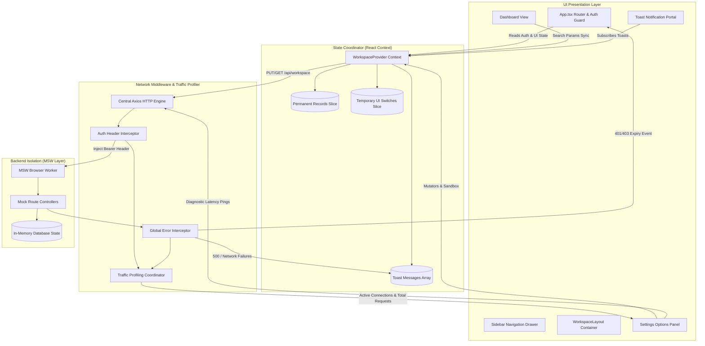

# TECHNICAL DESIGN DOCUMENT (TDD)
## Project Horizon — Onboarding Micro-Task Architecture Spec

| Document Metadata | Details |
|---|---|
| **Project** | Project Horizon — Onboarding Micro-Task Timeline |
| **Author** | Frontend Developer (Onboarding) |
| **Status** | Milestone Sign-Off / Production Review |
| **Version** | 1.0.0 (Day 1 - Day 8 Complete) |

---

## 1. Executive Summary & Objectives

Project Horizon is a high-performance, fault-tolerant enterprise admin workspace management system built with React 19, TypeScript, Vite, TailwindCSS, and Axios. 

### Key System Requirements:
- **Fluid Layout Engine:** Seamless scaling from 320px mobile viewports up to 1440px max desktop containers.
- **Strict Immutability State Tree:** Permanent state records isolated from transient UI controls using frozen data trees (`Object.freeze()`).
- **Network Interception & Resilience:** Global 401/403 session handling, 500+ crash reporting, traffic profiling, and `AbortController` request cancellation on unmount.
- **Backend Isolation Layer:** Mock Service Worker (MSW v2) intercepting HTTP requests with artificial latency profiling.
- **Production Performance:** Custom Vite Rollup manual chunk-splitting keeping core vendor assets isolated and optimized under 150 KB.

---

## 2. High-Level System Architecture Diagram

---

## 3. Subsystem Architecture Specifications

### 3.1 UI Layout & Grid Matrix
- **Fluid Breakpoint Grid:** Uses fractional column layout (`grid-template-columns: 260px 1fr` on desktop `md:`, collapsing to single column on mobile).
- **Responsive Thresholds:** Enforces minimum viewport width of `320px` to prevent layout breakdown, capping total layout container width at `1440px`.
- **Drawer State:** Off-canvas sliding mobile drawer driven by `isMobileDrawerOpen` context state.

### 3.2 Global Store Topology & Data Tree Protection
- **Permanent Records Slice:** Encapsulates identity details (`displayName`, `contactEmail`), system parameters (`environmentMode`, `maxRateLimit`), security toggles (`emailAlertsEnabled`, `systemLogsEnabled`), and telemetry `logs`.
- **Data Protection:** All state transitions apply `Object.freeze()` to prevent unintended in-place object mutations across React component boundaries.
- **Transient UI Slice:** Manages temporary UI state cleanly separated from persistent data models.

### 3.3 Network Engine, Interceptors & Traffic Profiling
- **Central HTTP Engine:** Configured Axios instance with `timeout: 10000ms` and `Content-Type: application/json`.
- **Auth Request Interceptor:** Automatically injects `Authorization: Bearer <token>` into outgoing requests.
- **Response Error Interceptor:**
  - `401 / 403`: Clears session credentials and triggers SPA router redirection to `/login` via an event callback listener.
  - `500+`: Emits system crash messages directly to the toast notification coordinator.
  - `Network Offline`: Dispatches network loss warnings to toast alerts.
- **Traffic Profiling:** Tracks active concurrent connections (`activeConnections`) and total request counts (`totalRequests`) to audit that single-interaction connection limits are enforced.

### 3.4 Backend Isolation & Mock Engine (MSW)
- **Service Worker Interception:** Uses Mock Service Worker (`msw/browser`) in development mode to intercept fetch/XHR traffic transparently without backend dependencies.
- **Mock Handlers:** Serves `/api/workspace` endpoints with artificial latency pings (`1000ms` delay) and simulated diagnostic error endpoints (`/api/trigger-401`, `/api/trigger-500`, `/api/trigger-offline`).

### 3.5 Fault Tolerance, Timing Utilities & Event Disposal
- **Custom Timer Hooks:**
  - `useInterval(callback, delay)`: Controlled interval execution with start/stop semantics.
  - `useTimeout(callback, delay)`: Self-clearing lifecycle timeout wrapper.
- **Debounce Management:**
  - `useDebounce<T>(value, delay)`: Reactive value debouncer for input fields.
  - `useDebouncedCallback(fn, delay)`: Function wrapper exposing explicit `.cancel()` disposal.
- **Event Disposal (`AbortController`):** Mount/unmount lifecycle hooks pass `AbortSignal` to HTTP requests to abort in-flight requests and prevent memory leaks.

---

## 4. Production Build & Optimization Specifications

- **Manual Chunk Splitting:** Rollup configuration in `vite.config.ts` partitions vendor packages:
  - **`vendor` chunk:** Core runtime libraries (`react`, `react-dom`, `react-router-dom`).
  - **`icons` chunk:** Icon system (`lucide-react`).
  - **`network` chunk:** HTTP and mock engines (`axios`, `msw`).
- **Target Bundle Constraint:** Initial JS bundle size constrained under `150 KB` warning limit.
- **TypeScript Compiler Options:** Enforces strict type checking via `strict`, `exactOptionalPropertyTypes`, `noImplicitReturns`, and `forceConsistentCasingInFileNames`.

---

## 5. Security & Input Sanitization Standard

- **Input Sanitization:** Custom `sanitizeString` utility strips `<script>` tags, generic HTML elements, dangerous URI schemes (`javascript:`, `data:text/html`), and inline DOM event attributes (`onerror=`, `onmouseover=`) to protect against XSS attack vectors.
- **Auth Guard:** Protected SPA routes redirect unauthenticated traffic to `/login` while preserving original target path coordinates via `?redirect=` parameters.

---

## 6. Error Boundaries & Exception Handling

### 6.1 Network & Interceptor Fallback Layer
- **Global Error Interception:** Unhandled network exceptions (e.g., server 500 errors, connection dropouts) are caught centrally by `apiClient` response interceptors and broadcast to the floating toast notification portal.
- **Session Expiration Interception:** `401 / 403` HTTP response statuses trigger automatic credential clearing and SPA router redirection to `/login` via `registerAuthExpiredListener`.

### 6.2 Application Resilience Strategy
- **Localized Error Boundaries (Planned):** Wrapping top-level page routes and dynamic feature panels inside React `ErrorBoundary` components ensures isolated component exceptions degrade gracefully without crashing the entire DOM root.

---

## 7. Testing Strategy & Quality Verification

### 7.1 Multi-Layer Quality Verification Architecture
1. **Static AST & Type Safety Gate:** Enforced via `npx tsc -b` with strict compiler flags (`exactOptionalPropertyTypes`, `noImplicitReturns`, `forceConsistentCasingInFileNames`).
2. **ESLint Quality Gate:** Enforced via `npm run lint` (`eslint . --max-warnings 0`) allowing zero warnings.
3. **Interactive Diagnostics Sandbox:** Integrated diagnostic panel in `Settings.tsx` providing live browser verification for:
   - Round-trip latency measurement (`performance.now()`)
   - Simulated 401 Unauthorized interceptor triggers
   - Simulated 500 Server crash interceptor triggers
   - Simulated network offline disconnections (`HttpResponse.error()`)
4. **Traffic Profiling & Event Disposal:** Real-time active connection tracking (`activeConnections`) verifying single connection interaction limits, with `AbortController` cancellation disposing in-flight requests on component unmount.
